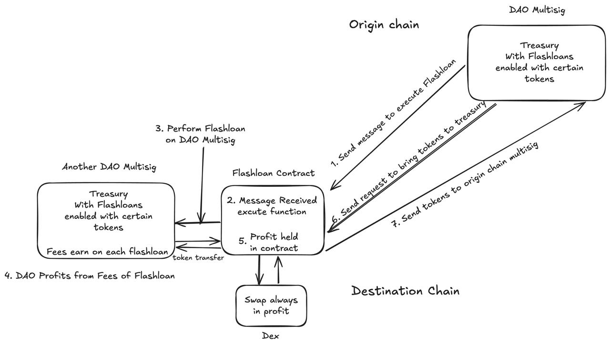

# FlashFi Cross Chain Overview

FlashFi uses LayerZero OApp and OFT. Users can initiate a cross-chain flash loan by calling the send function in the OApp Treasury contract on the original chain A, passing in the loan amount, profit, and the loan token address. The payload is transmitted to the target chain B through LayerZero's DVN, where it is decoded and used to call the simulateLiquidation function in the LiquidationSimulator contract to execute the flash loan.

Profits earned through the flash loan are stored in the LiquidationSimulator contract. Users can then initiate a cross-chain request from the original chain A to stake the profits into the pool on the target chain. On chain A, the OFT contract will mint OFT Tokens 1:1 for the user, allowing the user to exchange these OFT Tokens in the pool for stablecoins with a 1:1 value.

---

## Supported Cross-Chain OApp CallFunction and OFT Token Mint/Burn

### Base Sepolia to Mantle Sepolia
- **USDT Contract Address:** `0x70dDB1e89Ca415DDB8F6B0C609131713236D9617`
- **Token Contract Address:** `0xAE40A252ad7E2BFc8a86c5f8724d807F5326cd43`
- **Factory Contract Address:** `0x9FBe9D872df9701108fD2d33d96383269DC059fb`
- **DaoMultiSig Contract Address:** `0x8fe9ecC2B5e42a930483ea0dbBD4c824164b4d66`

**OApp Contracts:**
- **Treasury OApp (Base Sepolia):** `0x89E5B8aFE37acce001c39441A379A0cd9579b93e`
- **Flashloan OApp (Mantle Sepolia):** `0x707a272EEAee86F6F6927a75236fd8ea92e8f622`

---

### Base Sepolia to Scroll Sepolia
- **USDT Contract Address:** `0xBD0f25368f8323e499Af9B44f351A6e4DDE0db9c`
- **Token Contract Address:** `0x7dc164c0eF9A1B22724Cc70f0e7dE736c50b5464`
- **Factory Contract Address:** `0x0d44973607f76CB80d99A8eB8d70B097523DE584`
- **DaoMultiSig Contract Address:** `0x99f51a1A141A210Cc8e55Fa33616f582fad241d4`
- **Dex Contract Address:** `0x92BFAa0dA9F4E569d862cc45A32Bcaf19e8FAfF1`
- **Flashloan Contract Address:** `0xB869087eeA616eE91e8F3b3e32aD69dD3cDC138B`

**OApp Contracts:**
- **Treasury OApp (Base Sepolia):** `0x89E5B8aFE37acce001c39441A379A0cd9579b93e`
- **Flashloan OApp (Scroll Sepolia):** `0x9a047b5FEa6444aE8f945bA418821F496466707c`

---

### Base Sepolia to Arbitrum Sepolia
- **USDT Contract Address:** `0x0b60841Fb24381bB9c9Bbb5Bcd5430bb009B351c`
- **Token Contract Address:** `0xdCA4D52154762d2cA6d925A18Caad817cf990554`
- **Factory Contract Address:** `0xB869087eeA616eE91e8F3b3e32aD69dD3cDC138B`
- **DaoMultiSig Contract Address:** `0x3277d8987062F7a412702856D6fa7d93a4d8eDC0`
- **Dex Contract Address:** `0x990B88184e088524B2dB5925Ab45788AcD08b9b4`
- **Flashloan Contract Address:** `0x189878549E1fe744081BC2C4790Dc2c732De40C6`

**OApp Contracts:**
- **Treasury OApp (Base Sepolia):** `0x89E5B8aFE37acce001c39441A379A0cd9579b93e`
- **Flashloan OApp (Arbitrum Sepolia):** `0xaa5A117785Fbb955664956A1E4aD8CAD783596B1`

## Interface

### FlashloanOApp Contract

- **`constructor(address _endpoint, address _liquidationSimulator)`**  
  Initializes the contract, setting LayerZero endpoint and the LiquidationSimulator address.

- **`setLiquidationSimulator(address _liquidationSimulator) external onlyOwner`**  
  Updates the address of the LiquidationSimulator. Only the owner can call this function.

- **`setCount(uint256 _count) external`**  
  Sets the count variable. This is used for internal tracking purposes.

- **`send(uint32 _dstEid, string memory _message, bytes calldata _options) external payable`**  
  Sends a cross-chain message to the target endpoint ID (`_dstEid`) via LayerZero's `_lzSend`.

- **`_lzReceive(Origin calldata, bytes32, bytes calldata payload, address, bytes calldata) internal override`**  
  Receives the cross-chain payload and decodes the liquidation parameters. Calls `simulateLiquidation` on `LiquidationSimulator`.

- **`_callSimulateLiquidation(address borrowToken, address profitToken, uint256 borrowAmount) internal`**  
  Invokes the `simulateLiquidation` function in the `LiquidationSimulator` contract.

- **`_resetCount() internal`**  
  Resets the `count` variable to 10 after liquidation simulation.

### TreasuryOApp Contract

- **`constructor(address _endpoint)`**  
  Initializes the contract with the LayerZero endpoint.

- **`send(uint32 _dstEid, string memory _message, bytes calldata _options) external payable`**  
  Sends a cross-chain message to the target endpoint (`_dstEid`) via LayerZero's `_lzSend`.

- **`_lzReceive(Origin calldata, bytes32, bytes calldata payload, address, bytes calldata) internal override`**  
  Receives the cross-chain payload and decodes the message to store in `data`.
