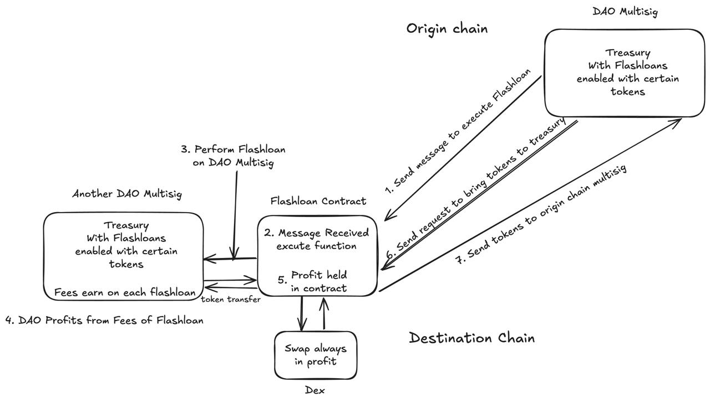

# FlashFi

FlashFi is a decentralized flash loan protocol designed specifically for DAOs, enabling efficient treasury management through multi-signature controlled flash loans.

## Overview

FlashFi revolutionizes DAO treasury management by allowing DAOs to utilize their idle treasury funds through a secure multi-signature flash loan system. Unlike traditional flash loan protocols where funds remain untouched, FlashFi enables DAOs to generate yield while maintaining security through multi-signature governance.

## Architecture

The FlashFi architecture consists of several key components working together to provide secure, multi-signature controlled flash loans:

1. **Smart Contract Layer**
   - Core Flash Loan Logic
   - Multi-signature Validation
   - Treasury Management Contracts
   - Security Controls

2. **Governance Layer**
   - DAO Multi-sig Controls
   - Proposal Management
   - Voting Mechanisms
   - Access Control

3. **Integration Layer**
   - External Protocol Interfaces
   - Cross-chain Bridges
   - Oracle Connections
   - API Endpoints

This architecture ensures secure treasury management while maintaining the flexibility needed for flash loan operations, all protected by multi-signature controls.

## Problem It Solves

### Treasury Management
- Enabling quick liquidity for time-sensitive opportunities while maintaining security through multi-sig approval
- Allowing temporary capital access without permanently moving funds from safe storage

### Risk Management
- The multi-sig requirement ensures multiple parties must approve any flash loan usage
- Prevents single points of failure in treasury operations

### Governance Efficiency
- Enables faster execution of approved proposals that require temporary capital
- Maintains decentralized control while improving operational speed

## Key Features

- **Multi-Signature Security**: All flash loan operations require multiple approvals
- **Permissionless Access**: Anyone can use the protocol while maintaining security
- **Same-Block Transactions**: Borrow and repay within the same block
- **Treasury Utilization**: Generate yield on previously idle DAO treasury funds
- **Low Risk Operations**: Focus on secure, profitable treasury management

## Use Cases

- Arbitrage opportunities
- Position management
- Cross-chain operations
- Yield generation on idle funds

## Advantages Over Traditional Flash Loans

Unlike existing solutions (e.g., Aave), FlashFi:
- Activates idle treasury funds
- Enables yield generation on previously dormant capital
- Maintains DAO security through multi-sig controls
- Provides permissionless access with built-in governance

## Getting Started

Please refer to individual package documentation for specific setup instructions:

- [FlashFi-Contracts](./FlashFi-Contracts/README.md) - Smart contract implementation
- [FlashFi-Interface](./FlashFi-Interface/README.md) - User interface

### Arbitrum smart contract address table

| Component | Address |
|-----------|-------------|
| USDT | [0x0b60841Fb24381bB9c9Bbb5Bcd5430bb009B351c](https://sepolia.arbiscan.io/address/0x0b60841Fb24381bB9c9Bbb5Bcd5430bb009B351c) |
| Token | [0xdCA4D52154762d2cA6d925A18Caad817cf990554](https://sepolia.arbiscan.io/address/0xdCA4D52154762d2cA6d925A18Caad817cf990554) |
| Factory | [0xB869087eeA616eE91e8F3b3e32aD69dD3cDC138B](https://sepolia.arbiscan.io/address/0xB869087eeA616eE91e8F3b3e32aD69dD3cDC138B) |
| DAO Multisig | [0x3277d8987062F7a412702856D6fa7d93a4d8eDC0](https://sepolia.arbiscan.io/address/0x3277d8987062F7a412702856D6fa7d93a4d8eDC0) |
| DEX | [0x990B88184e088524B2dB5925Ab45788AcD08b9b4](https://sepolia.arbiscan.io/address/0x990B88184e088524B2dB5925Ab45788AcD08b9b4) |
| Flashloan contract | [0x189878549E1fe744081BC2C4790Dc2c732De40C6](https://sepolia.arbiscan.io/address/0x189878549E1fe744081BC2C4790Dc2c732De40C6) |

### Base smart contract address table

| Component | Address |
|-----------|-------------|
| USDT | [0xaE8C50705fD0F1Ee54CAF5615cd4B5381C416B48](https://sepolia.basescan.org/address/0xaE8C50705fD0F1Ee54CAF5615cd4B5381C416B48) |
| Token | [0xBAE8146473796c202ED0439fc67e6F161C430159](https://sepolia.basescan.org/address/0xBAE8146473796c202ED0439fc67e6F161C430159) |
| Factory | [0xed815da5E8f9EeB71af564774eBbf9a25e1263a7](https://sepolia.basescan.org/address/0xed815da5E8f9EeB71af564774eBbf9a25e1263a7) |
| DAO Multisig | [0x413C429FDcD5132671F8D5f6E3ebB7600E953719](https://sepolia.basescan.org/address/0x413C429FDcD5132671F8D5f6E3ebB7600E953719) |
| DEX | [0x7Cd8f07401Ea6bC761b75184AfB33D4121A48754](https://sepolia.basescan.org/address/0x7Cd8f07401Ea6bC761b75184AfB33D4121A48754) |
| Flashloan contract | [0xab5104400eB6b7a7d54120ad05169a2eeFaDD33b](https://sepolia.basescan.org/address/0xab5104400eB6b7a7d54120ad05169a2eeFaDD33b) |

### Mantle smart contract address table

| Component | Address |
|-----------|-------------|
| USDT | [0x563Ce7D7984e323A94C469fBD905323a9F97Ca1d](https://sepolia.mantlescan.xyz/address/0x563Ce7D7984e323A94C469fBD905323a9F97Ca1d) |
| Token | [0xc53B53BCB61b2d34FDE6c4852BA8cd3B59619177](https://sepolia.mantlescan.xyz/address/0xc53B53BCB61b2d34FDE6c4852BA8cd3B59619177) |
| Factory | [0x1c1e13Cf5C9F8EBA03BB58fD066b466ed09201e6](https://sepolia.mantlescan.xyz/address/0x1c1e13Cf5C9F8EBA03BB58fD066b466ed09201e6) |
| DAO Multisig | [0x5Ec971128Ea605CB37aeF57Ca0011bB3b9E7994D](https://sepolia.mantlescan.xyz/address/0x5ec971128ea605cb37aef57ca0011bb3b9e7994d) |
| DEX | [0xe4E846a3c1bb3B16C76eb4D64292fadB0A72E813](https://sepolia.mantlescan.xyz/address/0xe4E846a3c1bb3B16C76eb4D64292fadB0A72E813) |
| Flashloan contract | [0xBDD1b9A14a4A5E6B7Ab9dbDfB8EaCA8bbe4931f1](https://sepolia.mantlescan.xyz/address/0xBDD1b9A14a4A5E6B7Ab9dbDfB8EaCA8bbe4931f1) |

### Rootstock smart contract address table

| Component | Address |
|-----------|-------------|
| Flashloan contract | [0x6f36Fd774e0a31Ba7e4eA0Eb888fCb0A20fa9262](https://rootstock-testnet.blockscout.com/address/0x6f36Fd774E0a31ba7E4EA0EB888fCb0a20Fa9262) |
| DEX |[0xaD1A172377f21d3d9d9Fb67cF08eA7A3E281cDBe](https://rootstock-testnet.blockscout.com/address/0xAd1A172377f21d3D9D9Fb67Cf08Ea7a3E281cDbE)|
| DAO Multisig | [0x2de7984aF8CF790cb3f967231CE99B9Ca56159b1](https://rootstock-testnet.blockscout.com/address/0x2De7984aF8cf790cb3F967231Ce99b9cA56159b1) |
| Factory | [0xab99a7BC0F0da16fF521525d64790bC133db4a0E](https://rootstock-testnet.blockscout.com/address/0xaB99A7bc0F0Da16Ff521525d64790bC133db4a0e) |
| Token | [0xbA18F2dC2CE0B971F33236fDF76e227bF9d8Ddbd](https://rootstock-testnet.blockscout.com/token/0xbA18F2dC2CE0B971F33236fDF76e227bF9d8Ddbd) |
| USDT | [0xeE9810a0C8f75e8ba724b11f6ECF550b1756163E](https://rootstock-testnet.blockscout.com/address/0xEe9810A0C8f75E8BA724b11F6EcF550B1756163E) |

### Celo smart contract address table

| Component | Address |
|-----------|-------------|
| Flashloan contract | [0xa1F0d0867D27F4cbA61970C70799185EC400F4C6](https://celo-alfajores.blockscout.com/address/0xa1F0d0867D27F4cbA61970C70799185EC400F4C6?tab=contract) |
| DEX | [0x507322B1B78BcdE26F1614060c24e0D23784250D](https://celo-alfajores.blockscout.com/address/0x507322B1B78BcdE26F1614060c24e0D23784250D?tab=contract) |
| DAO Multisig | [0x47e3C71832D60dC0ab630FDeA57dB203f62E40A5](https://celo-alfajores.blockscout.com/address/0x47e3C71832D60dC0ab630FDeA57dB203f62E40A5) |
| Mutlisig Factory | [0x70dDB1e89Ca415DDB8F6B0C609131713236D9617](https://celo-alfajores.blockscout.com/address/0x70dDB1e89Ca415DDB8F6B0C609131713236D9617) |
| Token | [0xed815da5E8f9EeB71af564774eBbf9a25e1263a7](https://celo-alfajores.blockscout.com/address/0xed815da5E8f9EeB71af564774eBbf9a25e1263a7?tab=contract) |
| USDT | [0xBAE8146473796c202ED0439fc67e6F161C430159](https://celo-alfajores.blockscout.com/address/0xBAE8146473796c202ED0439fc67e6F161C430159?tab=contract_source_code) |

### Scroll smart contract address table

| Component | Address |
|-----------|-------------|
| USDT | [0xBD0f25368f8323e499Af9B44f351A6e4DDE0db9c](https://sepolia.scrollscan.com/address/0xBD0f25368f8323e499Af9B44f351A6e4DDE0db9c) |
| Token | [0x7dc164c0eF9A1B22724Cc70f0e7dE736c50b5464](https://sepolia.scrollscan.com/address/0x7dc164c0eF9A1B22724Cc70f0e7dE736c50b5464) |
| Factory | [0x0d44973607f76CB80d99A8eB8d70B097523DE584](https://sepolia.scrollscan.com/address/0x0d44973607f76CB80d99A8eB8d70B097523DE584) |
| DAO Multisig | [0x99f51a1A141A210Cc8e55Fa33616f582fad241d4](https://sepolia.scrollscan.com/address/0x99f51a1A141A210Cc8e55Fa33616f582fad241d4) |
| DEX | [0x92BFAa0dA9F4E569d862cc45A32Bcaf19e8FAfF1](https://sepolia.scrollscan.com/address/0x92BFAa0dA9F4E569d862cc45A32Bcaf19e8FAfF1) |
| Flashloan contract | [0xB869087eeA616eE91e8F3b3e32aD69dD3cDC138B](https://sepolia.scrollscan.com/address/0xB869087eeA616eE91e8F3b3e32aD69dD3cDC138B) |

### Linea smart contract address table

| Component | Address |
|-----------|-------------|
| Factory | [0xcfc622e6330791d0899b32e59bf4c248b6844942](https://sepolia.lineascan.build/tx/0xe9b09808b16b206e2ad647165917ea6b78cbe93b4c8d7c62e39b6c8024705f9f) |
| DAO Multisig | [0x187b1d59c9cf36e174a6866070d9e65d71ccdbdf](https://sepolia.lineascan.build/tx/0x41a434e011f5a74e057a1e50dd8b050e2a503775e2de4a0f946675d8bcd024dc) |

### Zircuit smart contract address table

| Component | Address |
|-----------|-------------|
| Factory | [0x4277a06DF84b74Da159b2Fcd13863c6776E0d27d](https://explorer.testnet.zircuit.com/tx/0x18c8c8008b40de7fea6f459bbd30f708d2eaa7fbb8b93846b979fce66f7d9507) |
| DAO Multisig | [0x34BaFC39A86Ff244cF8BBfD8FBC5907473B77d31](https://explorer.testnet.zircuit.com/tx/0x3514f7d2020b53742ed144ce1d45eb9ac5d277dd912e7d788541859b8456074d) |

### Neon EVM smart contract address table

| Component | Address |
|-----------|-------------|
| Factory | [0x0d44973607f76CB80d99A8eB8d70B097523DE584](https://devnet.neonscan.org/tx/0xb759e56c02aecc205ba3324140d4f1367979c063ffce256786e41720e7731ada) |

### Base <=> Arbitrum smart contract address table

| Component | Address |
|-----------|-------------|
| Treasury_OApp | [0x89E5B8aFE37acce001c39441A379A0cd9579b93e](https://sepolia.basescan.org/address/0x89E5B8aFE37acce001c39441A379A0cd9579b93e) |
| Flashloan_OApp | [0xaa5A117785Fbb955664956A1E4aD8CAD783596B1](https://sepolia.arbiscan.io/address/0xaa5A117785Fbb955664956A1E4aD8CAD783596B1)|

### Base <=> Mantle smart contract address table

| Component | Address |
|-----------|-------------|
| Treasury_OApp | [0x89E5B8aFE37acce001c39441A379A0cd9579b93e](https://sepolia.basescan.org/address/0x89E5B8aFE37acce001c39441A379A0cd9579b93e) |
| Flashloan_OApp | [0x707a272EEAee86F6F6927a75236fd8ea92e8f622](https://sepolia.mantlescan.xyz/address/0x707a272eeaee86f6f6927a75236fd8ea92e8f622) |

## License

This project is licensed under the MIT License - see the [LICENSE](LICENSE) file for details.

