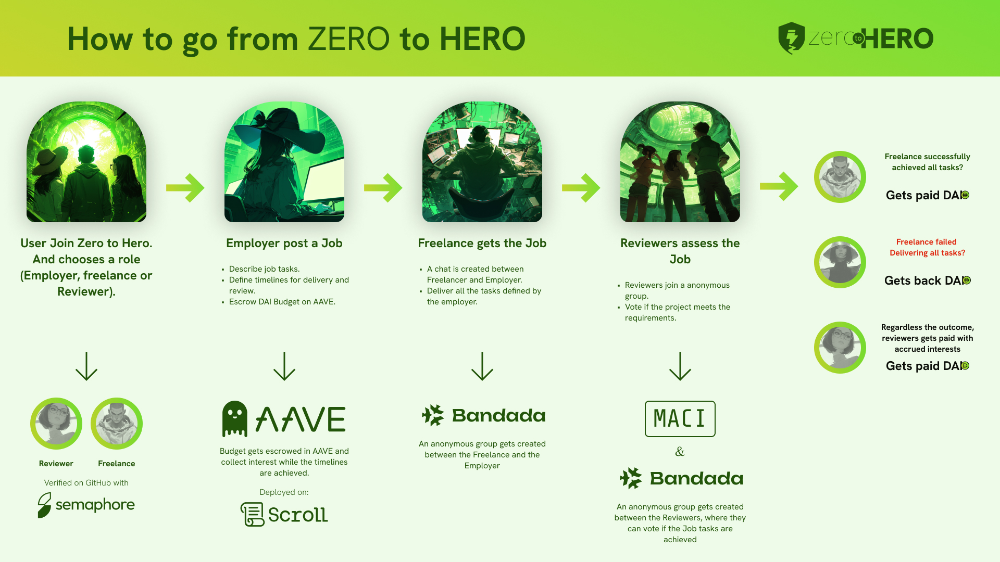

# Zero to Hero - A revolutionary hiring platform.

##

"Zero to Hero" introduces a pioneering peer-to-peer review system, ensuring a seamless, trustworthy experience for employers and freelancers alike. By integrating cutting-edge technologies such as Zero Knowledge proofs for anonymity and smart contracts for secure transactions, we are poised to overcome the shortcomings of traditional Web2 hiring platforms.

## Features

- **User Onboarding:** Individuals join "Zero to Hero" by selecting their desired role—Employer, Freelancer, or Reviewer—and are granted an anonymous identity. This process includes a unique verification step for Freelancers and Reviewers, utilizing GitHub Commits to establish credibility and expertise.

- **Job Creation and Specification:** Employers initiate the collaboration process by outlining a project, detailing required tasks, setting timelines for delivery and review, and securely escrowing the project's budget. This escrow is managed to accrue interest via AAVE.

- **Application and Selection:** Freelancers express interest in available projects by joining a pool of candidates. Employers then select the most suitable freelancer from this pool, then get facilitated an anonymous communication channel designed to monitor progress and ensure alignment on deliverables.

- **Review and Assessment:** TUpon project completion, a panel of Reviewers, steps in to evaluate the work against the Employer's criteria. This phase is critical, as it ensures that all requirements are met to the Employer's satisfaction. The outcome of this review process leads to one of two scenarios:

- **A. Successful Completion:** If the Freelancer's submission meets all specified criteria, the escrowed funds are released to the Freelancer.

- **B. Non-Compliance:** Should the Freelancer fail to meet the outlined requirements, the escrowed funds are returned to the Employer.

## Getting Started

To get started with Zero to Hero, follow these simple steps:

1. Clone the repository: `git clone https://github.com/chandrabosep/Circuit_Breaker-24`
2. Install dependencies: `npm install`

## Team

Meet the team behind Zero to Hero:

- **Chandra Bose:** FullStack Developer / [GitHub](https://github.com/chandrabosep)
- **David Zhang:** Smart Contract Developer / [GitHub](https://github.com/Solidityarchitect)
- **Camilo Leon:** Designer / [Linkedin](https://www.linkedin.com/in/camilo-leon/)
